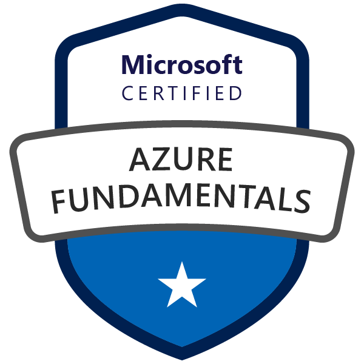
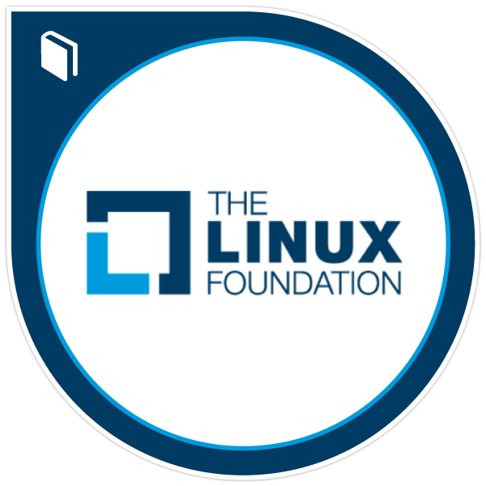
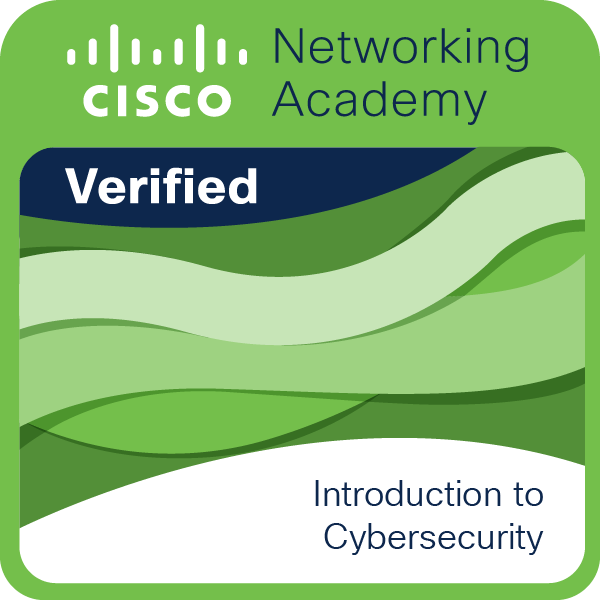
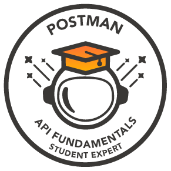

### Hi there 👋

- 🔭 I’m Kalhara. Thanks for reaching me out. ☺️

- 👨🏻‍💻 I'm a Computer Science undergraduate and a former Software Engineer Intern at [IFS](https://www.linkedin.com/company/ifs).

- 💬 Ask me about: Java, Golang, Python, Angular, NodeJs, Flask, MySQL, PostgreSQL, MongoDB, JavaScript, jQuery, Ajax, Bootstrap, Shell Scripting, Docker, Kubernetes, CI/CD, Azure & AI.

- 🤔 I’m on: [Medium](https://medium.com/@kalharatennakoon)

- 📫 How to reach me : [LinkedIn](https://lk.linkedin.com/in/kalharatennakoon)

- 😄 Pronouns: he/him/his  

   

---
<!-- **📄 Global Certifications** -->
### 📄 Global Certifications
- [Career Essentials in Generative AI by Microsoft and LinkedIn](https://www.linkedin.com/learning/certificates/3df7542a5c778a0e3e180571caf85ba59fb4a1afddbf58ea438e2e1badf72d80?u=60693444)
- [Career Essentials in Software Development by Microsoft and LinkedIn](https://www.linkedin.com/learning/certificates/552e0a946189687d3faef6a6d6d0a10f294ec818c64c7f12c538aa3d11a7e45c?u=60693444)
- [Microsoft Certified: Azure Fundamentals](https://www.credly.com/badges/1cd00bda-ffc7-467f-83a9-c8f7c9702be7/public_url)
- [Getting Started with Google Kubernetes Engine issued by Google Cloud](https://www.coursera.org/account/accomplishments/records/KHP2Z9NZ9FY7?utm_source=ln&utm_medium=certificate&utm_content=cert_image&utm_campaign=sharing_cta&utm_product=course)
- [AWS Fundamentals: Going Cloud-Native issued by AWS](https://coursera.org/share/a527b8fa5b14962328c02a3c3e8b54f9)
- [Google IT Support Professional Certificate](https://www.coursera.org/professional-certificates/google-it-support)
    - Course 1: [Technical Support Fundamentals](https://coursera.org/share/80b007757e46769957a1b6f74e9b4ddd)
    - Course 2: [The Bits and Bytes of Computer Networking](https://coursera.org/share/f2da8f96695a0407ca7a55911a97d978)
    - Course 3: [Operating Systems and You: Becoming a Power User](https://coursera.org/share/8c118843d8acc179bdc8f947fea30051)
- [Introduction to Cybersecurity issued by Cisco](https://www.youracclaim.com/badges/9061852c-fdf7-4219-926b-523d30a31111?source=linked_in_profile)
- [Getting Started with Azure DevOps Boards](https://coursera.org/share/41b703ac2707f8210d3ad8bb99359cd3)
- [Introduction to GitOps issued by The Linux Foundation](https://ti-user-certificates.s3.amazonaws.com/e0df7fbf-a057-42af-8a1f-590912be5460/26a061f2-539e-41a7-9e6a-8ee41a2d21ca-t-m-kalhara-randil-bandara-tennakoon-d03dccea-4781-4578-9d2c-de8fa9c0f7db-certificate.pdf)

<!-- - [Microsoft Learn Student Ambassador](https://drive.google.com/file/d/10Aj9nL742TRvVykNEFlkewj-zXQcTrw1/view?usp=sharing)
- [Postman Student Expert](https://api.badgr.io/public/assertions/rAqixGsKSpeFdMZ4KgqO1w?identity__email=kalharat81%40gmail.com) -->

     <a href="https://api.badgr.io/public/assertions/rAqixGsKSpeFdMZ4KgqO1w"> 

<!-- </a> -->

---

### 📕 Medium Blogs
<!-- BLOG-POST-LIST:START -->
- [Precautionary Steps to Protect Your Data in Case of an iPhone Theft](https://kalharatennakoon.medium.com/precautionary-steps-to-protect-your-data-in-case-of-an-iphone-theft-ba7b76bf89b8?source=rss-71d60f60a8aa------2)
- [Enhancing My Health through Apple Shortcuts: A Personal Journey.](https://kalharatennakoon.medium.com/enhancing-my-health-through-apple-shortcuts-a-personal-journey-bd0bd292f88c?source=rss-71d60f60a8aa------2)
- [How to Maximise iPhone Battery Life](https://kalharatennakoon.medium.com/how-to-maximise-iphone-battery-life-11a399a06653?source=rss-71d60f60a8aa------2)
- [Achieving Success: My Journey to Passing the Microsoft Azure Fundamentals &lpar;AZ 900&rpar; Exam](https://kalharatennakoon.medium.com/achieving-success-my-journey-to-passing-the-microsoft-azure-fundamentals-az-900-exam-2faeb0736489?source=rss-71d60f60a8aa------2)
- [Why daily exercises are essential for IT Industry Professionals?](https://kalharatennakoon.medium.com/why-daily-exercises-are-essential-for-it-industry-professionals-2b0524fcbb68?source=rss-71d60f60a8aa------2)
<!-- BLOG-POST-LIST:END -->

---

