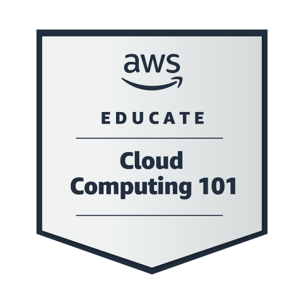
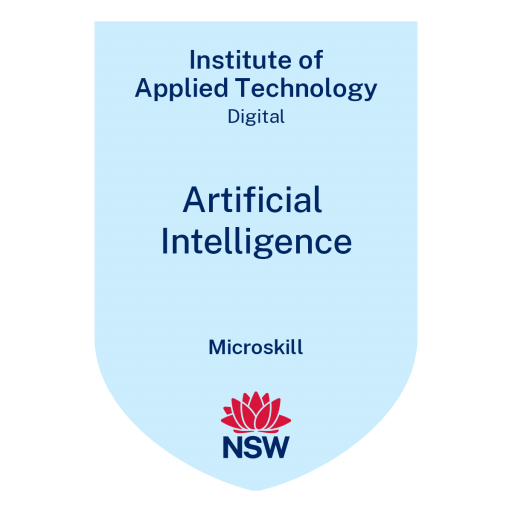

### Hi there 👋

- 🔭 I’m Kalhara. Thanks for reaching me out. ☺️

- 👨🏻‍💻 I'm a CS undergraduate.

- 💬 Ask me about: Java, Python, Golang, Angular, NodeJs, Flask, SQL, NoSQL, JavaScript, jQuery, Ajax, Bootstrap, Shell Scripting, Docker, Kubernetes, Tekton, CI/CD, Microsoft Azure & AI.

- 🤔 I’m on: [Medium](https://medium.com/@kalharatennakoon)

- 📫 How to reach me : [LinkedIn](https://lk.linkedin.com/in/kalharatennakoon)

- 😄 Pronouns: he/him/his  

  

---
<!-- **📄 Global Certifications** -->
### 📄 Global Certifications
- [Microsoft Certified: Azure AI Fundamentals (AI-900)](https://learn.microsoft.com/api/credentials/share/en-gb/TMKRBTennakoon/1C53DDEE0DB410A4?sharingId=87BD701455AA18AA)
- [Microsoft Certified: Azure Fundamentals (AZ-900)](https://www.credly.com/badges/1cd00bda-ffc7-467f-83a9-c8f7c9702be7/public_url)
- [Career Essentials in Generative AI by Microsoft and LinkedIn](https://www.linkedin.com/learning/certificates/3df7542a5c778a0e3e180571caf85ba59fb4a1afddbf58ea438e2e1badf72d80?u=60693444)
- [Career Essentials in Cybersecurity by Microsoft and LinkedIn](https://www.linkedin.com/learning/certificates/d61cd147c6fef73dbdcdf6cdcbb22c4b52dee28b5aaca3146517a08284fd2698)
- [Career Essentials in Software Development by Microsoft and LinkedIn](https://www.linkedin.com/learning/certificates/552e0a946189687d3faef6a6d6d0a10f294ec818c64c7f12c538aa3d11a7e45c?u=60693444)
- [Getting Started with Google Kubernetes Engine issued by Google Cloud](https://www.coursera.org/account/accomplishments/records/KHP2Z9NZ9FY7?utm_source=ln&utm_medium=certificate&utm_content=cert_image&utm_campaign=sharing_cta&utm_product=course)
- [AWS Fundamentals: Going Cloud-Native issued by AWS](https://coursera.org/share/a527b8fa5b14962328c02a3c3e8b54f9)
- [Google IT Support Professional Certificate](https://www.coursera.org/professional-certificates/google-it-support)
    - Course 1: [Technical Support Fundamentals](https://coursera.org/share/80b007757e46769957a1b6f74e9b4ddd)
    - Course 2: [The Bits and Bytes of Computer Networking](https://coursera.org/share/f2da8f96695a0407ca7a55911a97d978)
    - Course 3: [Operating Systems and You: Becoming a Power User](https://coursera.org/share/8c118843d8acc179bdc8f947fea30051)
- [Introduction to Cybersecurity issued by Cisco](https://www.youracclaim.com/badges/9061852c-fdf7-4219-926b-523d30a31111?source=linked_in_profile)
- [Getting Started with Azure DevOps Boards](https://coursera.org/share/41b703ac2707f8210d3ad8bb99359cd3)
- [Introduction to GitOps issued by The Linux Foundation](https://ti-user-certificates.s3.amazonaws.com/e0df7fbf-a057-42af-8a1f-590912be5460/26a061f2-539e-41a7-9e6a-8ee41a2d21ca-t-m-kalhara-randil-bandara-tennakoon-d03dccea-4781-4578-9d2c-de8fa9c0f7db-certificate.pdf)

 

---

### 📕 Medium Blogs
<!-- BLOG-POST-LIST:START -->
- [Getting Started with Behave Tests: A Beginner-Friendly Guide to BDD&lpar;Behavior-Driven Development&rpar;…](https://levelup.gitconnected.com/getting-started-with-behave-tests-a-beginner-friendly-guide-to-bdd-behavior-driven-development-aa5e182cf350?source=rss-71d60f60a8aa------2)
- [Must Know Features in iOS 18: Why This Update is a Game-Changer](https://kalharatennakoon.medium.com/must-know-features-in-ios-18-why-this-update-is-a-game-changer-9c3f2e6d7bad?source=rss-71d60f60a8aa------2)
- [Getting Started with Tekton Pipelines: A Beginner’s Guide to CI/CD on Kubernetes](https://levelup.gitconnected.com/getting-started-with-tekton-pipelines-a-beginners-guide-to-ci-cd-on-kubernetes-afd21e98b9fe?source=rss-71d60f60a8aa------2)
- [Precautionary Steps to Protect Your Data in Case of an iPhone Theft](https://kalharatennakoon.medium.com/precautionary-steps-to-protect-your-data-in-case-of-an-iphone-theft-ba7b76bf89b8?source=rss-71d60f60a8aa------2)
- [Enhancing My Health through Apple Shortcuts: A Personal Journey.](https://kalharatennakoon.medium.com/enhancing-my-health-through-apple-shortcuts-a-personal-journey-bd0bd292f88c?source=rss-71d60f60a8aa------2)
<!-- BLOG-POST-LIST:END -->

---
