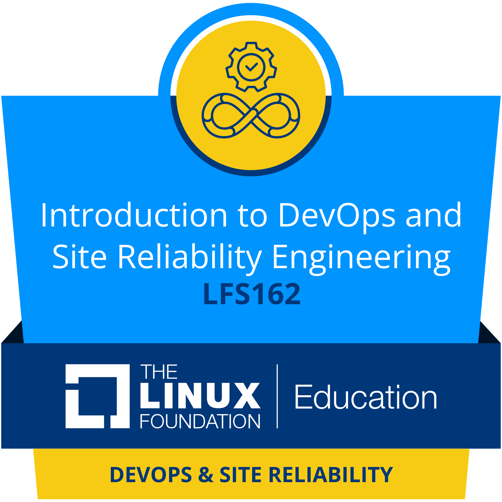
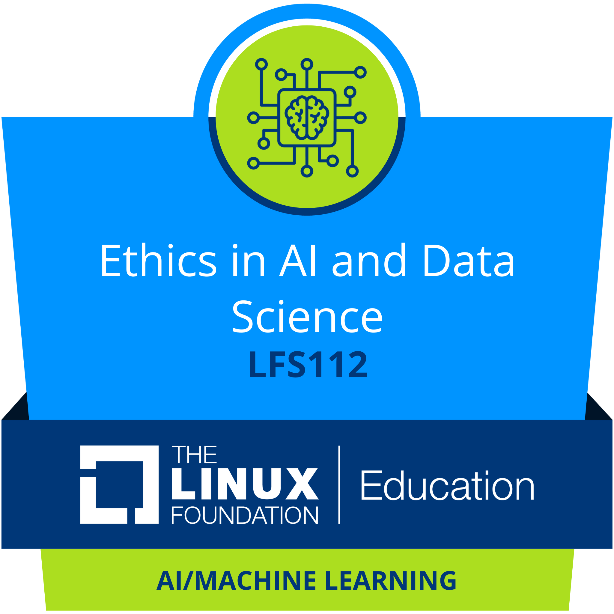
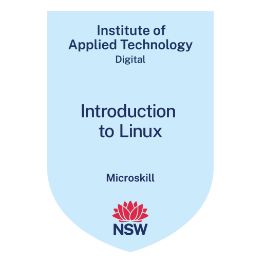
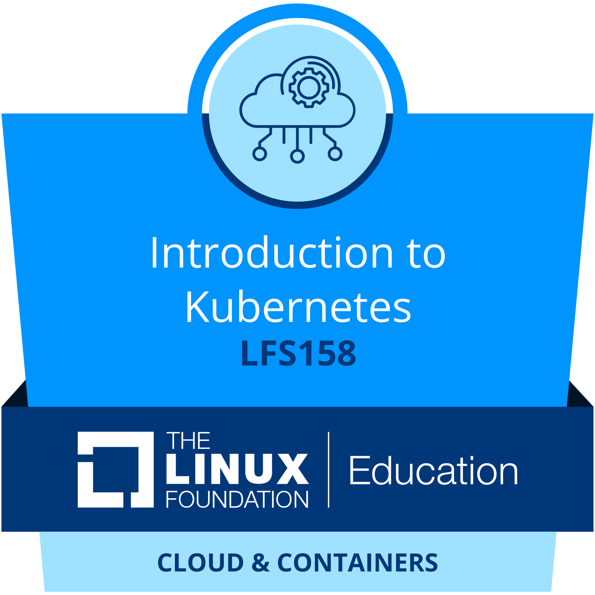
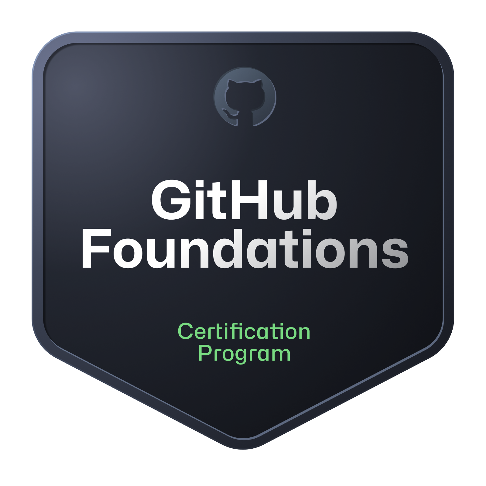
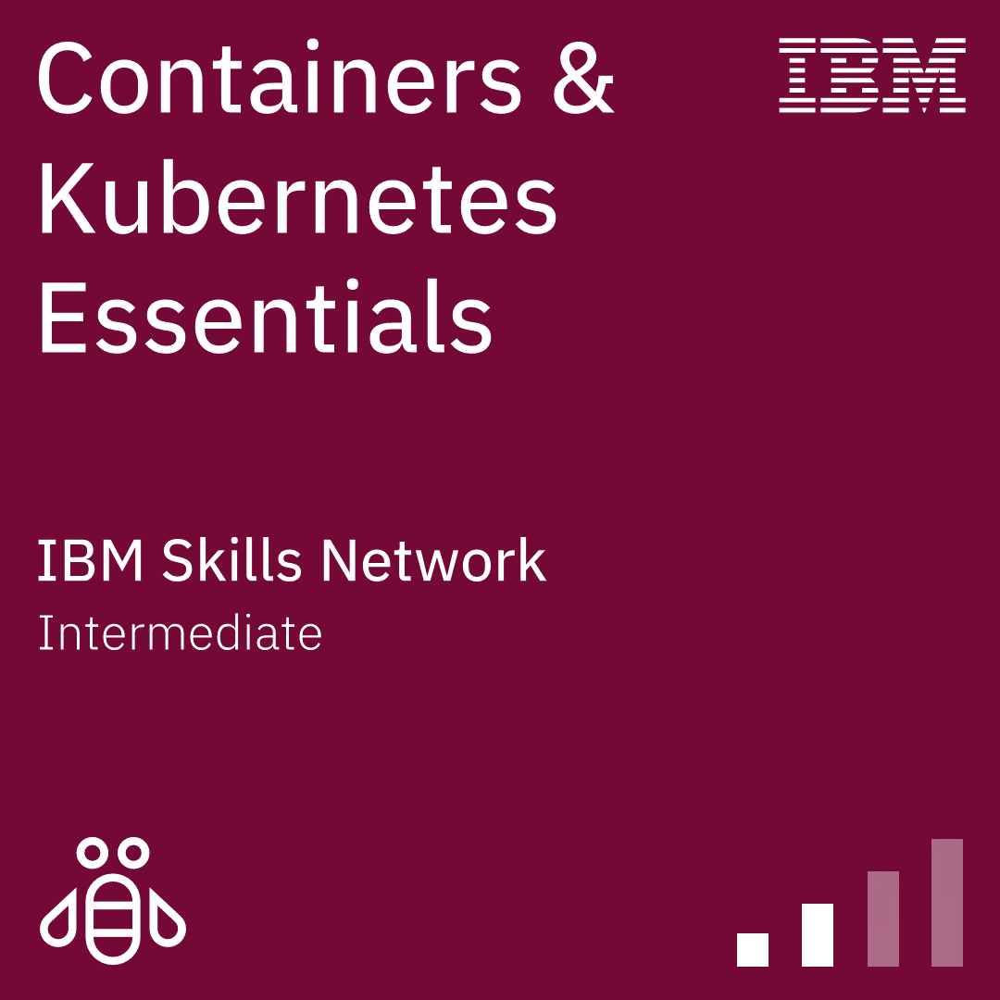
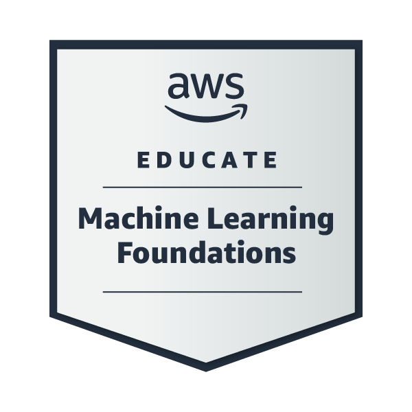
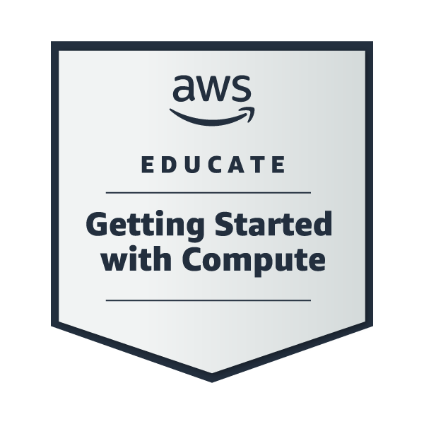
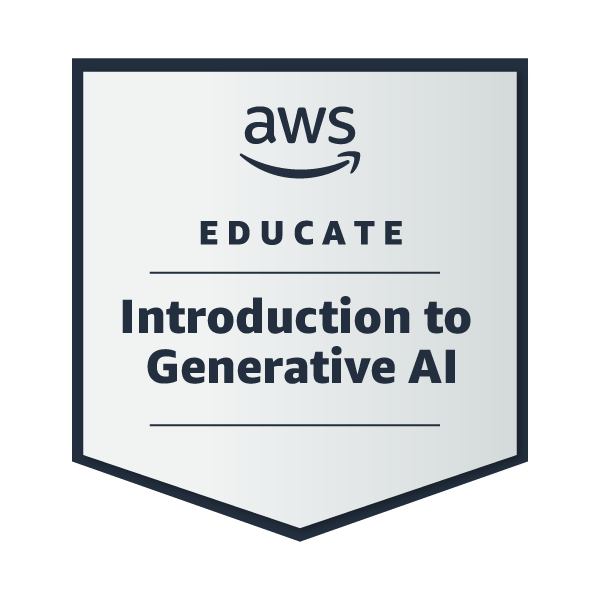

### Hi there 👋

- 🔭 I’m Kalhara. Thanks for reaching me out. ☺️

- 👨🏻‍💻 I'm a CS undergraduate and former DevOps Engineer Intern @IFS

- 💬 Ask me about: Java, Python, Golang, Angular, NodeJs, Flask, SQL, NoSQL, JavaScript, jQuery, Ajax, Bootstrap, Shell Scripting, Docker, Kubernetes, CI/CD, Microsoft Azure & AI.

- 🤔 I’m on: [Medium](https://medium.com/@kalharatennakoon)

- 📫 How to reach me : [LinkedIn](https://lk.linkedin.com/in/kalharatennakoon)

- 😄 Pronouns: he/him/his  

  

---

## 🚀 My Projects
- **Project Name:** AI Project Showcase
- **Description:** A brief overview of an exciting AI-powered application, demonstrating capabilities in machine learning and data analysis. (You can replace this with your actual project description).
- **Link:** `[View Project](#)` (You can replace # with your actual project link).
- **Image:** 

---
<!-- **📄 Global Certifications** -->
### 📄 Global Certifications
- [GitHub Foundations](https://www.credly.com/badges/91239f31-74c8-4175-93a0-0855efb3c46e/public_url)
- [Microsoft Certified: Azure Data Fundamentals (DP-900)](https://learn.microsoft.com/api/credentials/share/en-gb/TMKRBTennakoon/38133387373C82E1?sharingId=87BD701455AA18AA)
- [Microsoft Certified: Azure AI Fundamentals (AI-900)](https://learn.microsoft.com/api/credentials/share/en-gb/TMKRBTennakoon/1C53DDEE0DB410A4?sharingId=87BD701455AA18AA)
- [Microsoft Certified: Azure Fundamentals (AZ-900)](https://www.credly.com/badges/1cd00bda-ffc7-467f-83a9-c8f7c9702be7/public_url)
- [Career Essentials in Generative AI by Microsoft and LinkedIn](https://www.linkedin.com/learning/certificates/3df7542a5c778a0e3e180571caf85ba59fb4a1afddbf58ea438e2e1badf72d80?u=60693444)
- [Career Essentials in Cybersecurity by Microsoft and LinkedIn](https://www.linkedin.com/learning/certificates/d61cd147c6fef73dbdcdf6cdcbb22c4b52dee28b5aaca3146517a08284fd2698)
- [Career Essentials in Software Development by Microsoft and LinkedIn](https://www.linkedin.com/learning/certificates/552e0a946189687d3faef6a6d6d0a10f294ec818c64c7f12c538aa3d11a7e45c?u=60693444)
- [Getting Started with Google Kubernetes Engine issued by Google Cloud](https://www.coursera.org/account/accomplishments/records/KHP2Z9NZ9FY7?utm_source=ln&utm_medium=certificate&utm_content=cert_image&utm_campaign=sharing_cta&utm_product=course)
- [AWS Fundamentals: Going Cloud-Native issued by AWS](https://coursera.org/share/a527b8fa5b14962328c02a3c3e8b54f9)
- [Google IT Support Professional Certificate](https://www.coursera.org/professional-certificates/google-it-support)
    - Course 1: [Technical Support Fundamentals](https://coursera.org/share/80b007757e46769957a1b6f74e9b4ddd)
    - Course 2: [The Bits and Bytes of Computer Networking](https://coursera.org/share/f2da8f96695a0407ca7a55911a97d978)
    - Course 3: [Operating Systems and You: Becoming a Power User](https://coursera.org/share/8c118843d8acc179bdc8f947fea30051)
- [Introduction to Cybersecurity issued by Cisco](https://www.youracclaim.com/badges/9061852c-fdf7-4219-926b-523d30a31111?source=linked_in_profile)
- [Getting Started with Azure DevOps Boards](https://coursera.org/share/41b703ac2707f8210d3ad8bb99359cd3)
- [Introduction to GitOps issued by The Linux Foundation](https://ti-user-certificates.s3.amazonaws.com/e0df7fbf-a057-42af-8a1f-590912be5460/26a061f2-539e-41a7-9e6a-8ee41a2d21ca-t-m-kalhara-randil-bandara-tennakoon-d03dccea-4781-4578-9d2c-de8fa9c0f7db-certificate.pdf)
- [Introduction to Kubernetes issued by The Linux Foundation](https://ti-user-certificates.s3.amazonaws.com/e0df7fbf-a057-42af-8a1f-590912be5460/ff96589e-6699-4b22-847c-d9ec38812b30-t-m-kalhara-tennakoon-5b479bc0-2836-48c1-8abc-35ad7de91aa7-certificate.pdf)

 

---

### 📕 Medium Blogs
<!-- BLOG-POST-LIST:START -->
- [Building, Dockerizing, and Deploying a CRUD API in Go on Kubernetes](https://levelup.gitconnected.com/building-dockerizing-and-deploying-a-crud-api-in-go-on-kubernetes-9c25b01ad2e8?source=rss-71d60f60a8aa------2)
- [The Importance of Writing Clean Code.](https://levelup.gitconnected.com/the-importance-of-writing-clean-code-a4d453814373?source=rss-71d60f60a8aa------2)
- [The Critical Role of Feasibility Studies in Software Development](https://kalharatennakoon.medium.com/the-critical-role-of-feasibility-studies-in-software-development-dc7263c929be?source=rss-71d60f60a8aa------2)
- [Unlocking the Power of Apple Intelligence: Hype or Reality?](https://kalharatennakoon.medium.com/unlocking-the-power-of-apple-intelligence-hype-or-reality-824ef0c30f88?source=rss-71d60f60a8aa------2)
- [Getting Started with Behave Tests: A Beginner-Friendly Guide to BDD&lpar;Behavior-Driven Development&rpar;…](https://levelup.gitconnected.com/getting-started-with-behave-tests-a-beginner-friendly-guide-to-bdd-behavior-driven-development-aa5e182cf350?source=rss-71d60f60a8aa------2)
<!-- BLOG-POST-LIST:END -->

---
